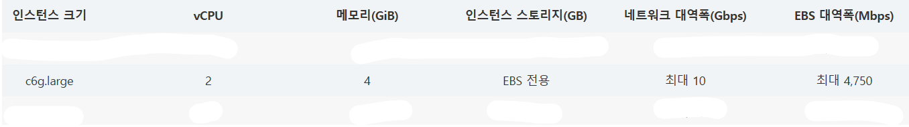
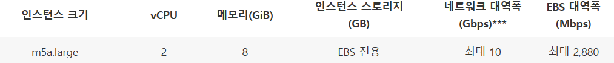
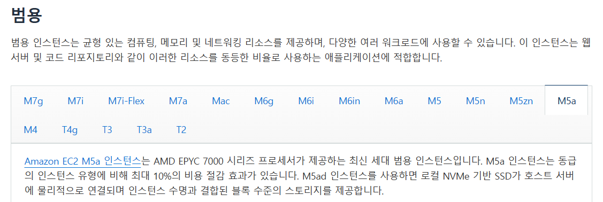
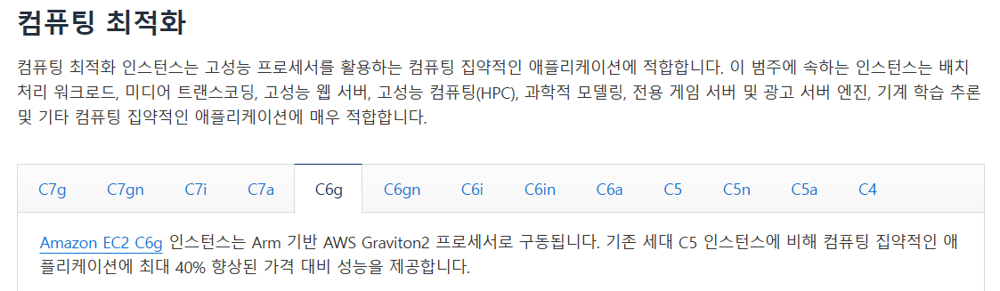
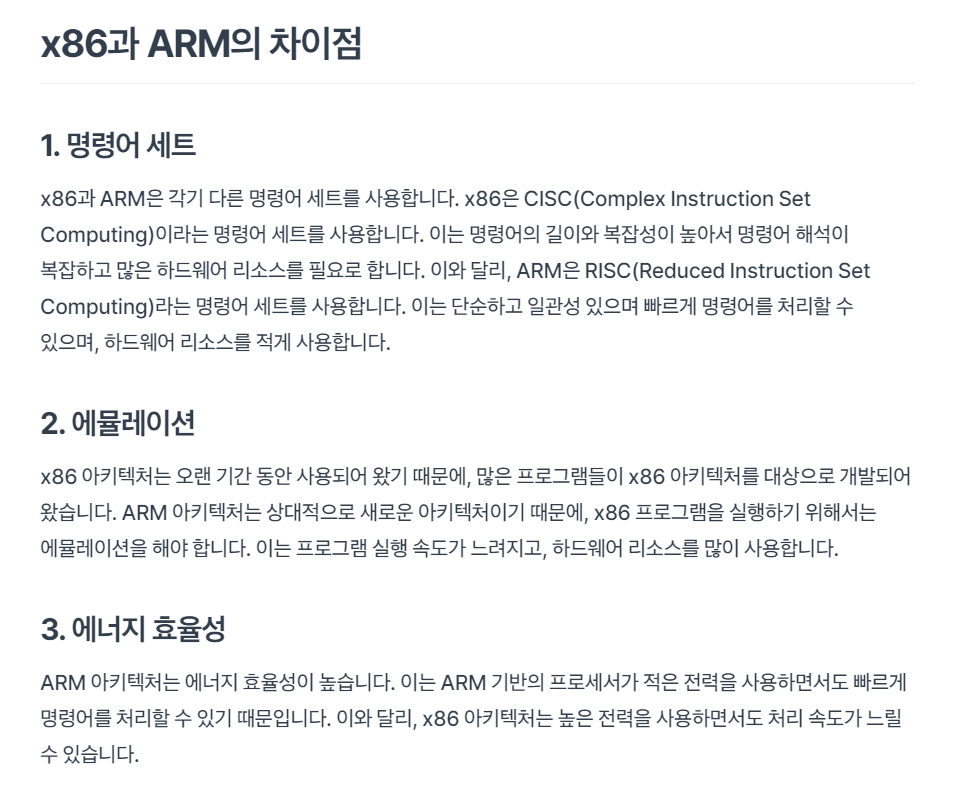
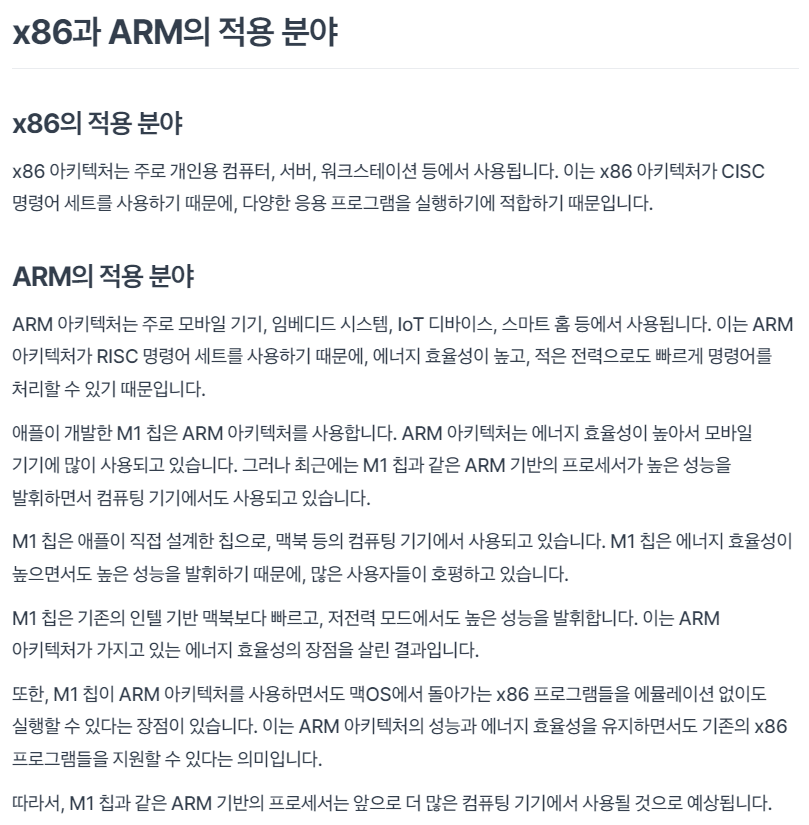

### 인스턴스 유형 중 T계열 성능 측정 및 비교
# t4g.smalll(arm): 83.81675028800964 초, 84.19329384038135 초, 83.6319204041349 초
# t2.small(x86):  81.82276749610901 초,  83.62790966033936 초, 84.87158346176147 초
###
# c6g.large(arm) 코드 실행 소요 시간: 89.2207818031311 초, 90.20206451416016 초,  89.40165519714355 초
# m5a.large(x86) 코드 실행 소요 시간: 94.36576509475708 초, 93.8557538986206 초, 94.04738092375641 초
### fact
# 
# 
# 
# 
# 
# 
